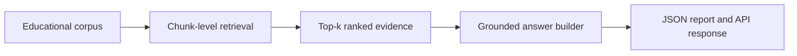

# Educational RAG Assistant

## PT-BR

### Visão rápida
Este projeto mostra como estruturar um **assistente educacional com RAG** em Python, pensado para contextos de education technology. O sistema recebe uma pergunta, recupera trechos relevantes de um corpus acadêmico e monta uma resposta grounded com citações explícitas.

### Por que este projeto faz sentido para EdTech
Em produtos educacionais, o risco de uma resposta errada não é só técnico. Ele afeta:
- confiança do estudante;
- aderência à política do curso;
- clareza sobre entregas e prazos;
- qualidade da experiência de aprendizagem.

Por isso, um assistente útil em educação precisa:
- recuperar evidência antes de responder;
- citar a origem da informação;
- limitar sua resposta ao que o corpus realmente sustenta.

### O que o projeto faz
1. Gera um corpus educacional local com syllabus, FAQ, rubric e reading notes.
2. Indexa o texto com `TF-IDF`.
3. Recupera os documentos mais relevantes para a pergunta.
4. Monta uma resposta grounded usando os trechos recuperados.
5. Exporta um relatório estruturado em `JSON`.
6. Expõe uma `FastAPI` simples para integração com engenharia.

### Arquitetura conceitual


### Estrutura do repositório
- [src/sample_data.py](src/sample_data.py)
  Gera o corpus local e registra a referência pública do dataset.
- [src/retrieval.py](src/retrieval.py)
  Implementa o retrieval lexical com `TF-IDF + cosine similarity`.
- [src/generation.py](src/generation.py)
  Constrói a resposta grounded e organiza as citações.
- [src/pipeline.py](src/pipeline.py)
  Orquestra o run ponta a ponta e exporta o relatório.
- [app.py](app.py)
  Expõe uma API simples em `FastAPI`.
- [tests/test_project.py](tests/test_project.py)
  Valida o contrato mínimo do pipeline.

### Corpus educacional
O corpus local foi desenhado para simular perguntas comuns em produtos de educação:
- políticas de entrega;
- dúvidas sobre office hours;
- critérios de avaliação;
- fundamentos de RAG;
- regras de integridade acadêmica.

Documentos incluídos:
- syllabus;
- study guide;
- assignment brief;
- course FAQ;
- reading notes;
- student handbook;
- rubric;
- course calendar.

### Técnicas utilizadas
#### 1. Retrieval lexical reproduzível
O projeto usa `TF-IDF` com `ngram_range=(1, 2)` e `cosine similarity`.

Por que isso é bom para o MVP:
- é determinístico;
- fácil de testar;
- não depende de API externa;
- permite demonstrar claramente a lógica de retrieval.

#### 2. Grounded generation
A resposta não é “inventada” a partir de conhecimento geral. Ela é montada usando os trechos recuperados.

Isso ajuda a mostrar:
- grounding;
- citações;
- limite explícito da resposta;
- comportamento mais seguro para educação.

#### 3. API pronta para handoff
O projeto inclui `FastAPI` porque a vaga pede forte integração com engenharia e código pronto para produção.  
Mesmo sendo um MVP, o repositório já mostra como esse RAG poderia ser consumido por um backend maior.

### Contrato de saída
O pipeline gera:
- [educational_rag_report.json](data/processed/educational_rag_report.json)

Campos principais:
- `question`
- `answer`
- `confidence`
- `sources`
- `limitation_note`

Na prática, isso é útil porque mantém a resposta estruturada para:
- logging;
- avaliação;
- observabilidade;
- integração com front-end ou backend.

### Resultado atual
- `dataset_source = educational_corpus_local_sample`
- `document_count = 8`
- `top_source = EDU-1001`
- `top_similarity = 0.2222`
- `confidence = 0.4111`

### Como executar
```bash
python3 main.py
python3 -m unittest discover -s tests -v
```

### Como rodar a API
```bash
uvicorn app:app --reload
```

Endpoints:
- `GET /health`
- `POST /ask`

Exemplo de payload:
```json
{
  "question": "What is the late submission policy?",
  "top_k": 3
}
```

### Contrato da API
`POST /ask` retorna:
- `question`
- `answer`
- `confidence`
- `sources`
- `limitation_note`

Esse contrato já deixa o projeto pronto para:
- front-end conversacional;
- logging e observabilidade;
- integração com backend de produto;
- handoff para engenharia.

### Do básico ao avançado
No nível básico, este é um projeto de retrieval + answer building.

No nível intermediário, ele é um **RAG educacional grounded**.

No nível avançado, ele permite discutir:
- corpus design para education tech;
- chunking e retrieval quality;
- confiança e limitation note;
- handoff para engenharia via API;
- evolução para embeddings, reranking e LangGraph.


### Próximos passos naturais
- trocar `TF-IDF` por embeddings;
- adicionar reranking;
- guardar documentos em `pgvector` ou `FAISS`;
- incluir avaliação offline por conjunto de perguntas esperadas;
- evoluir o fluxo para `LangGraph`.

### Arquitetura alvo em produção
Uma evolução natural deste MVP seria:
- ingestão automática de materiais de curso;
- indexação em vector store;
- retrieval híbrido;
- answer generation com LLM;
- tracing e avaliação;
- API plugada em produto educacional.

## EN

### Quick overview
This project structures an **educational RAG assistant** in Python for education technology use cases. It receives a question, retrieves relevant academic content, and builds a grounded answer with explicit citations.

### Why this matters for EdTech
In education products, a wrong answer affects not only technical quality but also:
- student trust;
- policy compliance;
- clarity around deadlines and deliverables;
- learning experience quality.

That is why an education-focused assistant should:
- retrieve evidence before answering;
- cite where the answer came from;
- stay constrained to the underlying corpus.

### What the project does
1. Builds a local educational corpus.
2. Indexes it with `TF-IDF`.
3. Retrieves top-ranked evidence for a question.
4. Builds a grounded answer.
5. Exports a structured `JSON` report.
6. Exposes a small `FastAPI` service for production-style integration.

### Output contract
The project exports:
- [educational_rag_report.json](data/processed/educational_rag_report.json)

Main fields:
- `question`
- `answer`
- `confidence`
- `sources`
- `limitation_note`

### Current result
- `dataset_source = educational_corpus_local_sample`
- `document_count = 8`
- `top_source = EDU-1001`
- `top_similarity = 0.2222`
- `confidence = 0.4111`

### Run locally
```bash
python3 main.py
python3 -m unittest discover -s tests -v
```

### API
```bash
uvicorn app:app --reload
```

### Advanced discussion points
This repository is useful to discuss:
- grounded RAG design for education;
- retrieval quality and chunk granularity;
- API handoff to engineering;
- evolution toward embeddings, reranking, and LangGraph.

### Production-facing interpretation
This MVP already separates:
- corpus generation;
- retrieval;
- answer construction;
- API delivery.

That separation makes the feature easier to hand off to engineering for production integration.
